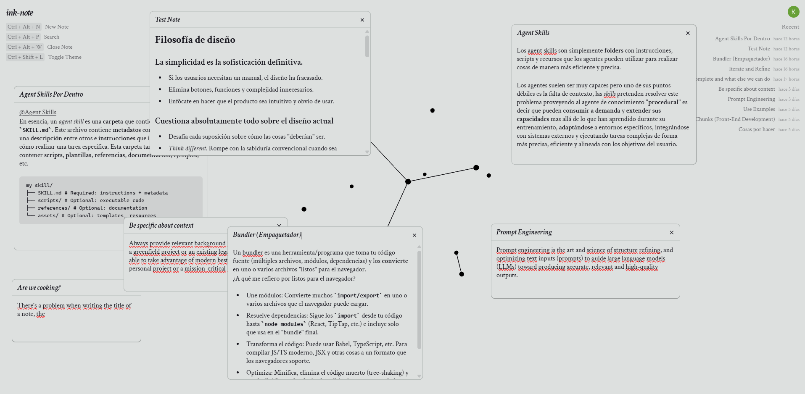

# ink-note

A node-based note-taking app with a 3D graph visualization.



## About

ink-note lets you create notes as draggable windows on a freeform canvas. Link notes together with @mentions, edit with a rich text editor, and watch your connections come to life in an interactive 3D force-directed graph.

Think of it as Obsidian, but worse -- and very green. There's no grand roadmap; this is a "build for fun" project aiming for a minimalistic style. Contributions are welcome.

## Tech Stack

React 19, TypeScript, Vite, Tailwind CSS 4, Convex, Clerk, TipTap, Three.js / React Three Fiber, Zustand, GSAP

## Setup

```bash
pnpm install
cp .env.example .env.local   # fill in your Convex + Clerk values
npx convex dev                # start the backend (keep running)
pnpm dev                      # start the frontend
```
